# ⚽ FutbolStats


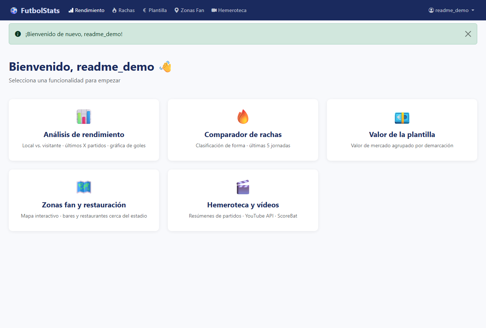

FutbolStats es una plataforma web desarrollada con **Django** para consultar, comparar y visualizar informacion de futbol de forma sencilla. La aplicacion esta pensada para que cualquier usuario pueda iniciar sesion, elegir una funcionalidad desde el menu superior y obtener resultados guiados por formularios, sugerencias automaticas, tablas, graficas, mapas y mensajes de ayuda.

Proyecto de la **Practica Final de Programacion Integrativa**, curso 2025-2026, GEI UDC.

## Integrantes

| Nombre | Email |
| --- | --- |
| Javier Galan Mendez | j.galan.mendez@udc.es |
| Javier Armada Rodriguez | javier.armada@udc.es |
| Manuel Valino Gonzalez | manuel.valino@udc.es |

**Equipo GitHub Classroom:** `pi2526-tr_33`  
**Repositorio:** https://github.com/GEI-PI-614G010492526/pi2526-tr_33

## Tabla de contenidos

- [Funcionalidades principales](#funcionalidades-principales)
- [Puesta en marcha](#puesta-en-marcha)
- [Guia de uso con capturas](#guia-de-uso-con-capturas)
- [Consejos de uso seguro](#consejos-de-uso-seguro)
- [Estructura del proyecto](#estructura-del-proyecto)
- [Pruebas](#pruebas)
- [APIs y errores habituales](#apis-y-errores-habituales)

## Funcionalidades principales

| ID | Funcionalidad | Que permite hacer | API principal |
| --- | --- | --- | --- |
| F0 | Usuarios | Registro, login, logout y acceso privado a la web | Django Auth |
| F1 | Rendimiento | Analizar goles a favor, goles en contra y diferencia de goles como local y visitante | football-data.org |
| F2 | Rachas | Comparar la clasificacion oficial con un ranking de forma reciente | football-data.org |
| F3 | Plantilla | Consultar valor estimado de mercado por jugador y posicion | API-Football |
| F4 | Zonas Fan | Buscar bares y restaurantes cercanos al estadio de un equipo | API-Football, Nominatim, Overpass |
| F5 | Hemeroteca | Buscar y reproducir resumenes de partidos desde YouTube | YouTube Data API v3 |

## Puesta en marcha

### Requisitos

- Docker y Docker Compose, recomendado para la entrega.
- O Python 3.11/3.12 con las dependencias de `futbolstats/requirements.txt`.
- Archivo `.env` dentro de `futbolstats/` con las claves necesarias.


### Ejecucion con Docker

```bash
cd futbolstats
docker compose up --build
```

Despues abre la web en:

```text
http://localhost:8000
```

Para crear un superusuario:

```bash
docker compose exec web python manage.py createsuperuser
```

### Ejecucion local sin Docker

```bash
cd futbolstats
python -m venv .venv
.venv\Scripts\activate
pip install -r requirements.txt
python manage.py migrate
python manage.py runserver
```

## Guia de uso con capturas

### F0. Registro, login y navegacion

Al entrar en la web sin sesion iniciada, FutbolStats muestra la pantalla de login. Introduce tu usuario y contrasena, o pulsa **Registrate aqui** si todavia no tienes cuenta.

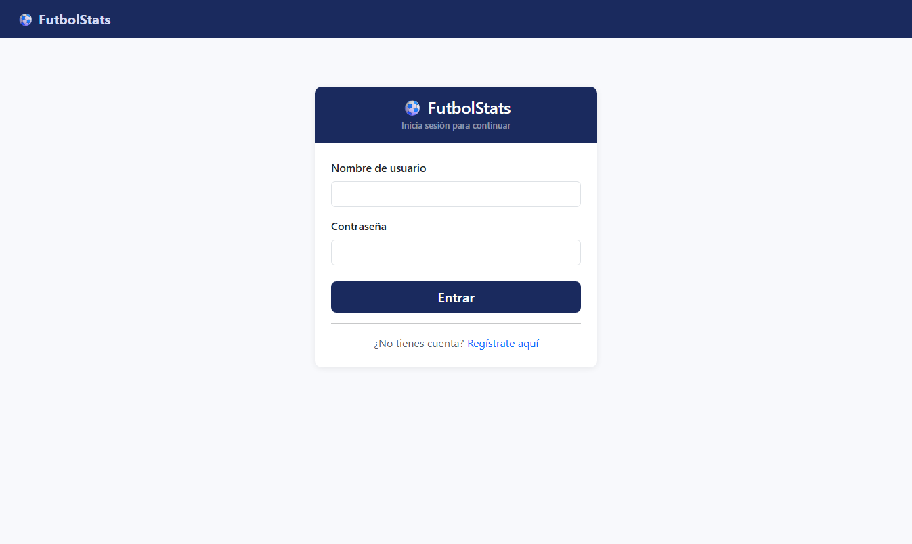

En el registro se completan los datos de usuario. Cuando la cuenta se crea correctamente, la aplicacion inicia sesion automaticamente y redirige al panel principal.

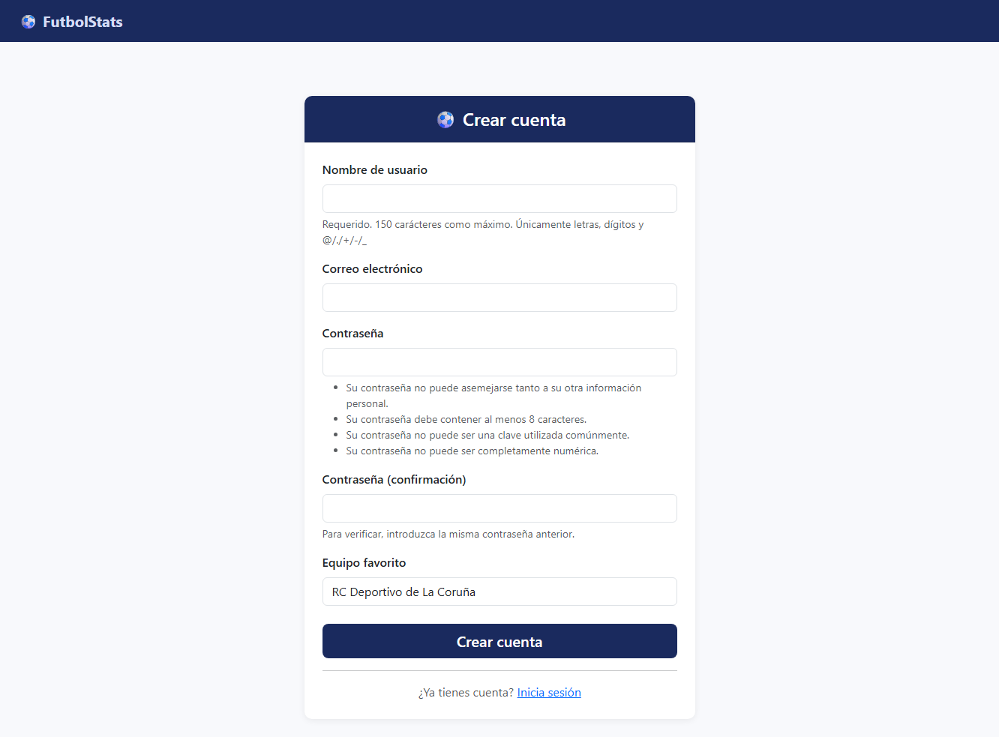

El dashboard muestra una tarjeta por funcionalidad. Tambien puedes usar siempre la barra superior: **Rendimiento**, **Rachas**, **Plantilla**, **Zonas Fan** y **Hemeroteca**. A la derecha aparece tu usuario y la opcion de cerrar sesion.


### F1. Analisis de rendimiento

Esta seccion sirve para estudiar como rinde un equipo en sus ultimos partidos, separando su comportamiento como local y como visitante.

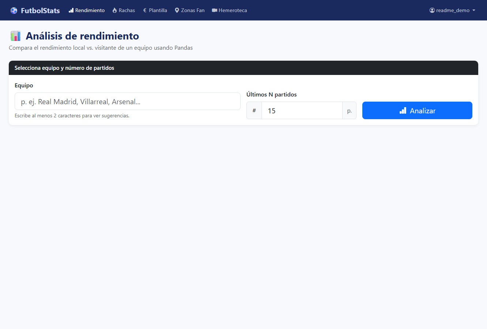

Como usarlo:

1. Entra en **Rendimiento**.
2. Escribe el nombre del equipo. A partir de 2 caracteres aparecen sugerencias.
3. Indica cuantos partidos quieres analizar, entre 1 y 30.
4. Pulsa **Analizar**.
5. Si hay varios equipos con nombre parecido, selecciona el correcto en la lista.

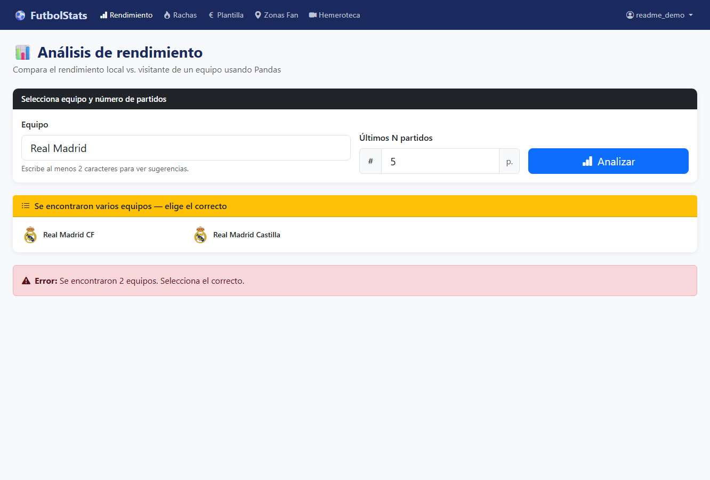

Cuando la consulta se completa, la pantalla muestra medias de goles a favor, goles en contra y diferencia de goles. Tambien aparecen graficas con la evolucion por partido y tablas con los encuentros usados para el calculo.

### F2. Rachas y clasificacion de forma

Rachas compara la clasificacion oficial de una competicion con un ranking calculado solo con los ultimos partidos. Es util para detectar equipos que llegan en buena o mala dinamica.

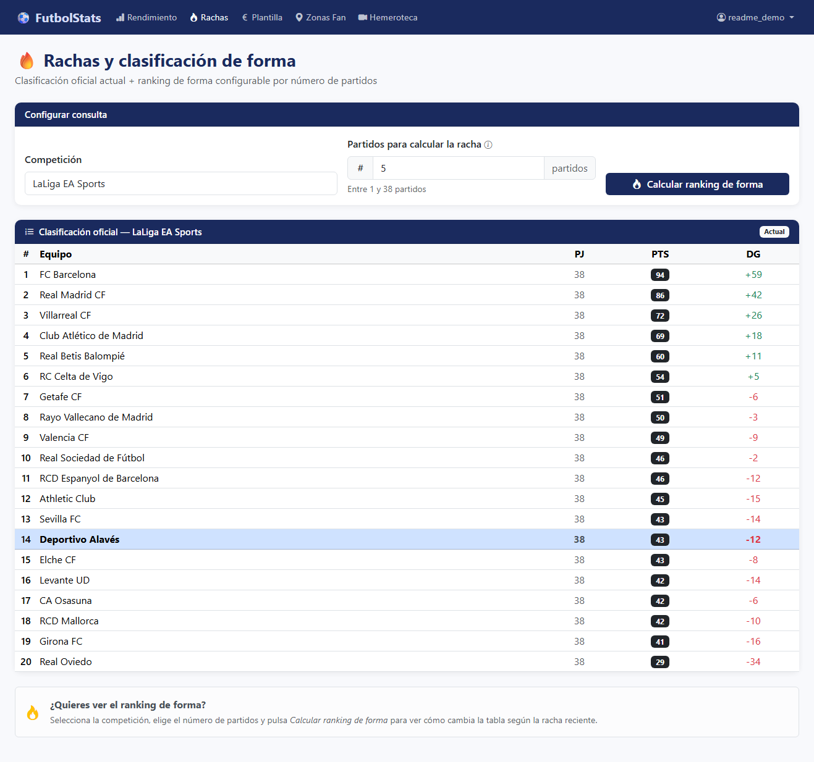

Como usarlo:

1. Entra en **Rachas**.
2. Elige la competicion. Puedes escribir para ver sugerencias.
3. Indica cuantos partidos recientes quieres usar para calcular la racha, entre 1 y 38.
4. Pulsa **Calcular ranking de forma**.

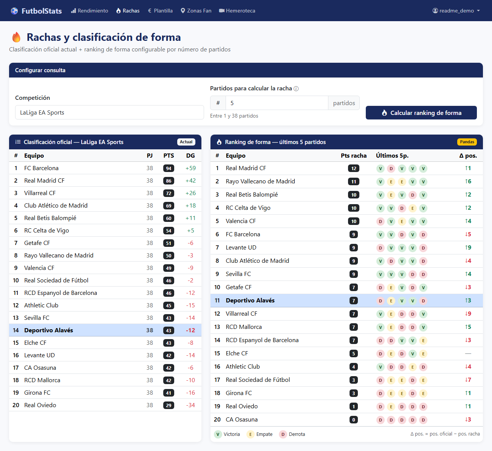

Como interpretar la tabla:

- **PTS** son los puntos de la clasificacion oficial.
- **Pts racha** son los puntos obtenidos solo en los ultimos N partidos.
- **V**, **E** y **D** significan victoria, empate y derrota.
- **Delta pos.** indica cuanto cambia la posicion del equipo al mirar solo la forma reciente.

### F3. Valor de mercado de la plantilla

Plantilla calcula una estimacion del valor de mercado de los jugadores de un equipo, agrupando la informacion por posicion y mostrando el detalle individual.


Como usarlo:

1. Entra en **Plantilla**.
2. Escribe el nombre de un equipo o pulsa uno de los equipos sugeridos.
3. Usa las sugerencias para evitar errores de escritura.
4. Pulsa **Ver plantilla**.

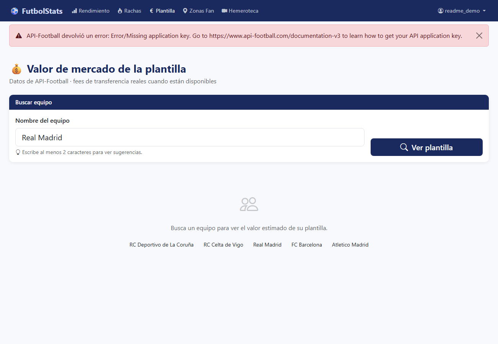

Si `API_FOOTBALL_KEY` esta configurada correctamente, veras el valor total de la plantilla, el resumen por posicion y una tabla de jugadores. Si falta la clave o la API rechaza la consulta, la web muestra un aviso claro en la parte superior para que el usuario sepa que no es un fallo de uso.

### F4. Zonas fan y restauracion

Zonas Fan busca locales cercanos al estadio de un equipo. La pantalla combina un formulario de busqueda, un radio configurable y un mapa interactivo con la lista de resultados.

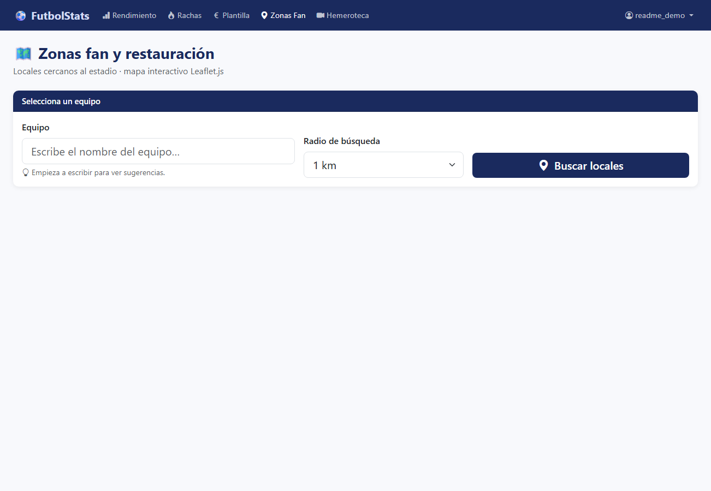

Como usarlo:

1. Entra en **Zonas Fan**.
2. Escribe el equipo.
3. Selecciona el radio de busqueda: 500 m, 1 km o 2 km.
4. Pulsa **Buscar locales**.
5. Cuando haya resultados, usa el mapa para orientarte y pulsa en una fila de la tabla para centrar el local.

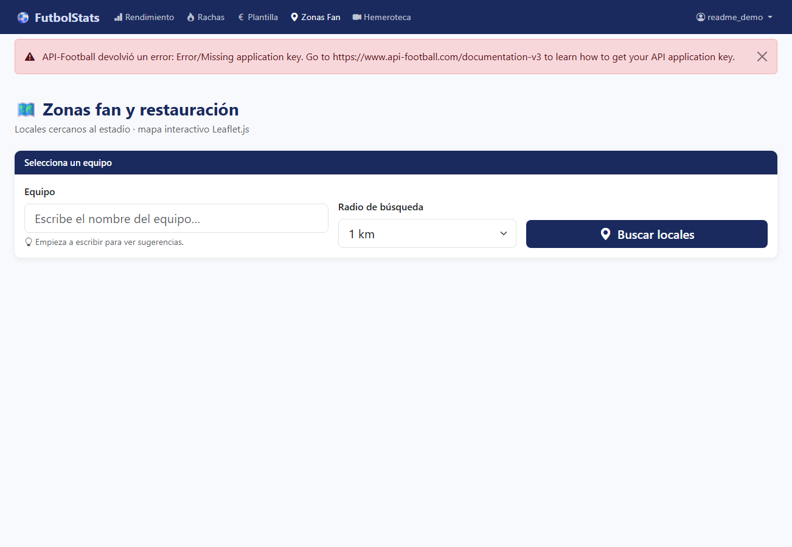

Esta funcionalidad necesita `API_FOOTBALL_KEY` para localizar el estadio. Si la clave no esta disponible, la aplicacion informa al usuario con un mensaje de error seguro. Con la clave activa, el mapa Leaflet muestra el estadio, el circulo de busqueda y los locales encontrados.

### F5. Hemeroteca y videos

Hemeroteca permite buscar resumenes de partidos historicos o recientes. Los videos se cargan desde YouTube y se pueden reproducir dentro de la propia pagina cuando el propietario lo permite.

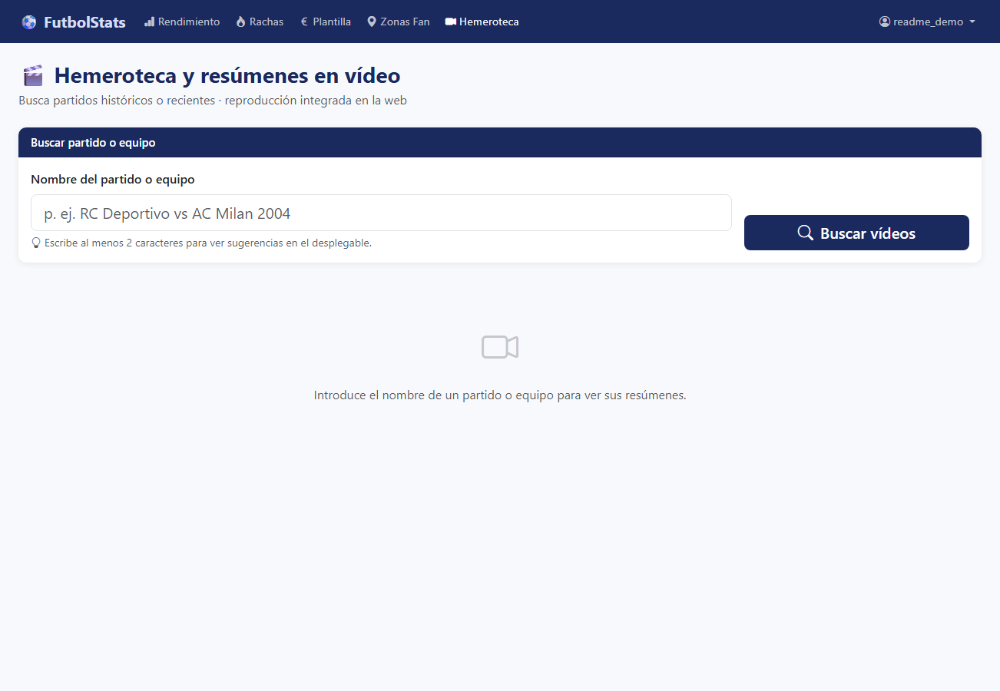

Como usarlo:

1. Entra en **Hemeroteca**.
2. Escribe un equipo, un partido o una busqueda concreta, por ejemplo `RC Deportivo vs AC Milan 2004`.
3. Usa las sugerencias del desplegable si aparecen.
4. Pulsa **Buscar videos**.
5. Reproduce el video destacado o pulsa **Reproducir aqui** en cualquiera de los videos relacionados.

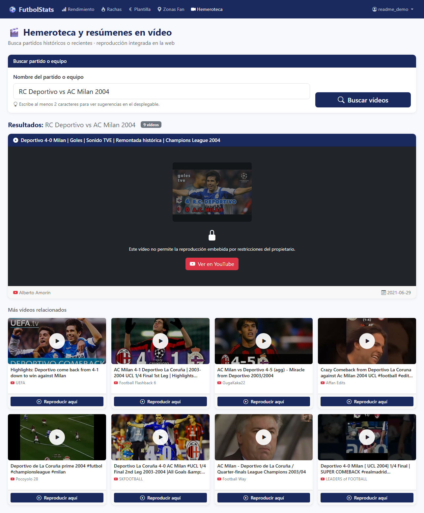

Si YouTube bloquea la reproduccion embebida de un video, FutbolStats muestra un boton **Ver en YouTube**. Esto evita que el usuario se quede ante una pantalla rota y le ofrece una salida segura.

## Consejos de uso seguro

- Usa las sugerencias de autocompletado siempre que sea posible para elegir el equipo correcto.
- Evita pulsar varias veces seguidas los botones de busqueda: algunas APIs tienen limites de peticiones.
- Si aparece un aviso rojo o amarillo, lee el mensaje antes de repetir la consulta. Normalmente indica falta de clave, limite de API, equipo no encontrado o video no embebible.

## Estructura del proyecto

```text
futbolstats/
├── accounts/        # F0: login, logout y registro
├── rendimiento/     # F1: analisis local vs visitante
├── rachas/          # F2: clasificacion y ranking de forma
├── plantilla/       # F3: valor de mercado de plantilla
├── zonas_fan/       # F4: mapa de locales cercanos al estadio
├── hemeroteca/      # F5: busqueda de videos
├── futbolstats/     # configuracion Django
    ├── docs/screenshots # capturas usadas en este README
├── templates/       # plantillas HTML
├── static/          # CSS y JavaScript
├── Dockerfile
├── docker-compose.yml
├── manage.py
└── requirements.txt
```

## Pruebas

Con Docker:

```bash
cd futbolstats
docker compose exec web python manage.py test
```

Sin Docker:

```bash
cd futbolstats
python manage.py test
```

## APIs y errores habituales

| Situacion | Que significa | Que hacer |
| --- | --- | --- |
| `Missing application key` | Falta una clave de API en `.env` | Revisar `API_FOOTBALL_KEY`, `FOOTBALL_DATA_API_KEY` o `YOUTUBE_API_KEY` |
| HTTP 403 | La API rechaza la clave o el plan no permite ese recurso | Comprobar permisos y cuota de la API |
| HTTP 429 | Se ha superado el limite de peticiones | Esperar unos minutos antes de repetir |
| Equipo no encontrado | El nombre no coincide con la API | Usar autocompletado o probar otra variante del nombre |
| Video no embebible | YouTube no permite reproducirlo dentro de la web | Usar el boton **Ver en YouTube** |

## Cambios respecto al anteproyecto

- **F4:** se sustituyo el planteamiento inicial por una combinacion de API-Football, Nominatim y Overpass para obtener estadio y locales cercanos.
- **F5:** se usa YouTube Data API v3 para obtener videos y se incluye fallback a YouTube si el propietario bloquea el iframe.
- **Scouting:** queda fuera del alcance final por limitaciones de tiempo.

---

FutbolStats busca que el usuario pueda explorar datos futbolisticos sin conocer las APIs internas: elegir, consultar, interpretar resultados y entender los errores cuando algo externo no esta disponible.

---

## Horas de trabajo semanales

| Semana | Javier G. | Javier A. | Manuel V. |
|--------|-----------|-----------|-----------|
| 1 (27/04) | 4h | 4h | 4h |
| 2 (4/05) | 5h | 5h | 5h |
| 3 (5/05) | 4h | 4h | 4h |
| 4 (6/05) | 4h | 4h | 4h |
| 5 (7/05) | 3h | 3h | 3h |
| 6 (8/05) | 2h | 2h | 2h |
| 7 (13/05) | 3h | 3h | 3h |
| 8 (29/05) | 4h | 4h | 4h |
| 9 (30/05) | 4h | 4h | 4h |
| … | … | … | … |

*(tabla actualizada semanalmente)*

---